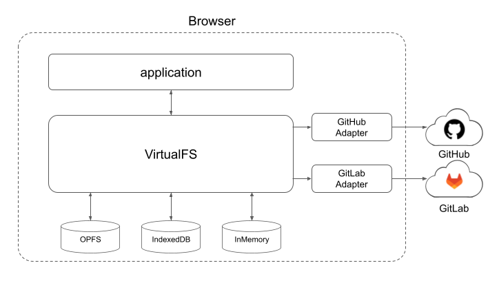

# browser-git-ops

browser-git-ops is a zero-server GitHub/GitLab operations library 
that works entirely in the browser without CORS proxy.

[](https://deepwiki.com/nojaja/browser-git-ops) [](https://github.com/nojaja/browser-git-ops/blob/main/README_ja.md)

- **Live Demo**: https://nojaja.github.io/browser-git-ops/

**[English](./README.md)** | **[日本語](./README_ja.md)**

## Overview



## Why browser-git-ops?
Most browser-based Git solutions suffer from CORS issues or require a backend proxy.

browser-git-ops is designed specifically for:

- Zero-server applications
- CORS-free GitHub/GitLab operations
- High-level repository data management

### Comparison
| Feature                 | browser-git-ops | isomorphic-git | Octokit |
| ----------------------- | --------------- | -------------- | ------- |
| Browser Native               | ✅               | ✅              | ✅       |
| No CORS Proxy Required             | ✅               | ❌              | —       |
| File Change Detection with VirtualFS     | ✅               | ✖（None）          | —       |
| GitHub & GitLab Adapter | ✅               | ✖              | 	API only   |
| IndexedDB / OPFS Support   | ✅               | ✖              | —       |


## Key Features

- **VirtualFS**: Local workspace snapshotting and change-set generation (create/update/delete)
- **Multiple Storage Backends**:
  - `OpfsStorage` - Origin Private File System (OPFS)
  - `IndexedDatabaseStorage` - IndexedDB for broader browser compatibility
  - `InMemoryStorage` - In-memory storage for testing
- **Platform Adapters**: `GitHubAdapter` and `GitLabAdapter` implementing common push/pull flows via Web APIs
- **CORS-Free Operations**: Direct API integration without proxy workarounds
- **TypeScript Support**: Fully typed API with TypeScript definitions

## v0.0.5: FS-compatible API

- Adds Node-like filesystem methods on `VirtualFS`: `stat`, `unlink`, `mkdir`, `rmdir`, `readdir`.
- `Stats` objects now include Git identifiers when available (`gitBlobSha`, `gitCommitSha`).
- `deleteFile` is removed from the public API; use `unlink` instead.

## Status

- ✅ Core VirtualFS functionality (delta generation, index management, local edits)
- ✅ Persistence backends for OPFS and IndexedDB
- ✅ GitHubAdapter with primary push/pull flows
- ✅ GitLabAdapter with primary push/pull flows
- ✅ GitLab tree API pagination (offset-based, per_page=100) for repositories with 100+ files
- ✅ GitHub truncated tree detection with warning log for repositories exceeding 100,000 entries / 7 MB

## Installation

### For Library Consumers (npm)

```bash
npm install browser-git-ops
```

### For Development

```bash
git clone https://github.com/nojaja/browser-git-ops.git
cd browser-git-ops
npm ci
```

## Usage

### Basic Example

```typescript
import { VirtualFS, OpfsStorage, GitHubAdapter } from 'browser-git-ops'

async function example() {
  // 1. Initialize VirtualFS with OPFS backend
  const backend = new OpfsStorage('appname','my-workspace')
  const vfs = new VirtualFS({ backend })
  await vfs.init()

  // 2. Configure adapter (GitHub or GitLab)
  await vfs.setAdapter({
    type: 'github',
    branch: 'main',
    token: 'your-github-token',
    opts: {
      owner: 'your-username',
      repo: 'your-repo',
    }
  })
  // Alternative overloads:
  //   await vfs.setAdapter('github', 'https://github.com/your-username/your-repo', 'main', 'your-github-token')
  //   await vfs.setAdapter('https://github.com/your-username/your-repo', 'main', 'your-github-token')

  // 3. Pull latest content from remote
  await vfs.pull()

  // 4. List files (use the FS-compatible API)
  const files = await vfs.readdir('.')
  console.log('Files:', files)

  // 5. Make local changes
  await vfs.writeFile('README.md', '# Hello World')
  await vfs.writeFile('docs/guide.md', '## Getting Started')

  // 6. Stat a file (Stats includes gitBlobSha/gitCommitSha when available)
  // 6. Stat a file — returned object implements fs.Stats-like shape
  //    When the file is tracked by a configured adapter, the returned
  //    stats may include Git-specific identifiers: gitBlobSha, gitCommitSha, gitRef.
  const s = await vfs.stat('README.md')
  console.log('size=', s.size, 'isFile=', s.isFile())
  // Git-specific fields (may be undefined for non-tracked files):
  console.log('gitBlobSha=', s.gitBlobSha, 'gitCommitSha=', s.gitCommitSha, 'gitRef=', s.gitRef)

  // 7. Delete a file (use unlink instead of deleteFile)
  await vfs.unlink('docs/guide.md')

  // 8. Create/remove directories
  await vfs.mkdir('notes')
  await vfs.rmdir('notes', { recursive: true })
  // 9. Get change set and push
  const changes = await vfs.getChangeSet()
  console.log('Changes:', changes)

  const index = await vfs.getIndex()
  const result = await vfs.push({
    parentSha: index.head,
    message: 'Update documentation',
    changes: changes
  })
  console.log('Push result:', result)
}
```

### Using IndexedDB Backend

```typescript
import { VirtualFS, IndexedDatabaseStorage } from 'browser-git-ops'

const backend = new IndexedDatabaseStorage('my-workspace')
const vfs = new VirtualFS({ backend })
await vfs.init()
```

### Using GitLab Adapter

```typescript
await vfs.setAdapter({
  type: 'gitlab',
  branch: 'main',
  token: 'your-gitlab-token',
  opts: {
    projectId: 'username/project',
    host: 'gitlab.com',
  }
})
// Alternative overloads:
//   await vfs.setAdapter('gitlab', 'https://gitlab.com/username/project', 'main', 'your-gitlab-token')
//   await vfs.setAdapter('https://gitlab.com/username/project', 'main', 'your-gitlab-token')
```

## Development

### Build

```bash
npm run build       # Build browser bundles and TypeScript definitions
```

This generates:
- `dist/index.js` - IIFE bundle for browser (global `APIGitLib`)
- `dist/index.mjs` - ESM bundle
- `dist/index.d.ts` - TypeScript definitions

### Testing

```bash
npm run test        # Unit tests (Jest)
npm run test:spec   # Specification tests only
npm run test:coverage # Tests with coverage report
npm run test:e2e    # E2E tests (Playwright)
npm run lint        # ESLint
```

### Documentation

```bash
npm run docs        # Generate TypeDoc documentation
```

## Project Structure

```
src/
├── index.ts                     # Package entry point
├── virtualfs/
│   ├── virtualfs.ts            # VirtualFS core implementation
│   ├── opfsStorage.ts          # OPFS storage backend
│   ├── indexedDatabaseStorage.ts # IndexedDB storage backend
│   ├── inmemoryStorage.ts      # In-memory storage (for testing)
│   ├── changeTracker.ts        # Change detection and tracking
│   ├── conflictManager.ts      # Merge conflict resolution
│   ├── indexManager.ts         # Index file management
│   └── types.ts                # Type definitions
└── git/
    ├── abstractAdapter.ts      # Base adapter interface
    ├── githubAdapter.ts        # GitHub API adapter
    └── gitlabAdapter.ts        # GitLab API adapter

examples/                        # Browser demo application
test/
├── unit/                        # Jest unit tests
└── e2e/                         # Playwright E2E tests
```

## Configuration

### GitHub Adapter

To use the GitHub adapter, you need:
- **Personal Access Token** with `repo` scope
- Repository owner and name
- Target branch (default: `main`)
- **Large repositories**: If the recursive tree response exceeds 100,000 entries or 7 MB, the `truncated` flag is detected and a warning is logged. Files within the returned tree are still available.

### GitLab Adapter

To use the GitLab adapter, you need:
- **Personal Access Token** or **Project Access Token**
- Project ID (format: `username/project` or numeric ID)
- GitLab instance host (default: `gitlab.com`)
- Target branch (default: `main`)
- **Large repositories**: Tree listing is automatically paginated (offset-based, `per_page=100`) so that repositories with any number of files are fully fetched during `pull`.

### Browser Compatibility

- **OPFS**: Requires modern browsers with OPFS support (Chrome 102+, Edge 102+)
- **IndexedDB**: Broader compatibility, works in most modern browsers
- **CORS**: No proxy required - uses direct API authentication

## API Reference

- See [docs/typedoc-md/README.md](docs/typedoc-md/README.md).

### VirtualFS

Main class for file system operations.

```typescript
class VirtualFS {
  constructor(options?: { backend?: StorageBackend; logger?: Logger })
  
  // Initialization
  async init(): Promise<void>
  
  // File Operations
  async writeFile(path: string, content: string): Promise<void>
  async readFile(path: string): Promise<string>
  async deleteFile(path: string): Promise<void>
  async renameFile(fromPath: string, toPath: string): Promise<void>
  async listPaths(): Promise<string[]>
  
  // Change Management
  async getChangeSet(): Promise<ChangeItem[]>
  async revertChanges(): Promise<void>
  
  // Remote Synchronization (overloads)
  async setAdapter(meta: AdapterMeta): Promise<void>
  async setAdapter(type: string, url: string, branch?: string, token?: string): Promise<void>
  async setAdapter(url: string, branch?: string, token?: string): Promise<void>
  async getAdapter(): Promise<AdapterMeta | null>
  async getAdapterInstance(): Promise<any | null>
  getAdapterMeta(): AdapterMeta | null
  async pull(reference?: string, baseSnapshot?: Record<string, string>): Promise<any>
  async push(input: CommitInput): Promise<any>
  
  // Conflict Resolution
  async getConflicts(): Promise<ConflictItem[]>
  async resolveConflict(path: string, resolution: 'local' | 'remote'): Promise<void>
  
  // Index Management
  async getIndex(): Promise<IndexFile>
  async saveIndex(): Promise<void>
}

// AdapterMeta and related types:
// interface AdapterMeta {
//   type: string;
//   url?: string;        // Repository URL (can be derived from opts)
//   branch?: string;     // Target branch (default: 'main')
//   token?: string;
//   opts?: {
//     host?: string;
//     owner?: string;     // GitHub
//     projectId?: string; // GitLab
//     repo?: string;
//   }
// }
// Stored (normalized) format in indexManager:
// { type, url, branch, token, opts: { host, owner, projectId, repo } }
// When branch is omitted it defaults to 'main'.

// Stats-like object returned by `vfs.stat(path)` includes standard fields
// similar to Node.js `fs.Stats` and may include Git identifiers when available.
// Example Type (informational):
// interface FsStatsLike {
//   dev: number; ino: number; mode: number; nlink: number; uid: number; gid: number;
//   size: number; atime: Date; mtime: Date; ctime: Date; birthtime: Date;
//   isFile(): boolean; isDirectory(): boolean;
//   // Git-specific (optional):
//   gitBlobSha?: string; // blob SHA for tracked file
//   gitCommitSha?: string; // latest commit SHA touching this path
//   gitRef?: string; // reference/branch used to derive these values
// }
```

#### Adapter Retrieval and Management

```typescript
// Get persisted adapter metadata (configuration, not instance)
async getAdapter(): Promise<AdapterMeta | null>
// Example:
const meta = await vfs.getAdapter()
if (meta) {
  console.log('Adapter type:', meta.type)
  console.log('Branch:', meta.branch)   // top-level field (default: 'main')
  console.log('Token:', meta.token)
  console.log('Owner:', meta.opts?.owner) // GitHub case
}

// Get cached adapter metadata synchronously
getAdapterMeta(): AdapterMeta | null
// Example:
const meta = vfs.getAdapterMeta()

// Get or create adapter instance (lazy initialization)
async getAdapterInstance(): Promise<any | null>
// Example:
const adapter = await vfs.getAdapterInstance()
if (adapter) {
  // adapter.resolveRef, adapter.push, etc. are now available
}
```

**Note**: 
- `getAdapter()` and `getAdapterInstance()` serve different purposes
- `getAdapter()` returns persisted metadata (type, url, branch, token, opts)
- `getAdapterInstance()` creates/retrieves the adapter instance from metadata
- `getAdapterMeta()` synchronously returns cached metadata (no Promise)

### Storage Backends

```typescript
// OPFS Backend
class OpfsStorage implements StorageBackend {
  constructor(namespace: string, rootName?: string)
}

// IndexedDB Backend
class IndexedDatabaseStorage implements StorageBackend {
  constructor(namespace: string, rootName?: string)
}

// In-Memory Backend (for testing)
class InMemoryStorage implements StorageBackend {
  constructor(namespace: string, rootName?: string)
}
```

### Platform Adapters

```typescript
// GitHub Adapter
// Truncated tree responses (100,000+ entries) are automatically detected
// and logged as a warning; fetched files are still returned.
class GitHubAdapter {
  constructor(options: {
    owner: string
    repo: string
    token: string
    branch?: string
    host?: string   // GitHub Enterprise host (optional)
  })
}

// GitLab Adapter
// Tree listing is automatically paginated (per_page=100) to support
// repositories with any number of files.
class GitLabAdapter {
  constructor(options: {
    projectId: string
    host: string
    token: string
    branch?: string
    host?: string   // Self-hosted GitLab instance (optional)
  })
}
```

## Examples

See the [`examples/`](examples/) directory for:
- Interactive browser demo with UI
- Playwright E2E test scenarios
- Multiple storage backend examples

## Contributing

Contributions are welcome! Please follow these guidelines:

1. **Open an Issue**: For significant changes, please open an issue first to discuss your proposal
2. **Follow Conventions**: 
   - Use TypeScript
   - Follow ESLint rules (`npm run lint`)
   - Write tests for new features
   - Update documentation as needed
3. **Testing**: Ensure all tests pass before submitting PR
   ```bash
   npm run lint
   npm run build
   npm run test
   npm run test:e2e
   ```

## Support

- **Issues**: https://github.com/nojaja/browser-git-ops/issues
- **Discussions**: https://github.com/nojaja/browser-git-ops/discussions
- **Documentation**: https://nojaja.github.io/browser-git-ops/

## License

MIT License - see the [LICENSE](LICENSE) file for details.

## Author

Maintained by [nojaja](https://github.com/nojaja) ([free.riccia@gmail.com](mailto:free.riccia@gmail.com))

## Acknowledgments

This project uses:
- OPFS (Origin Private File System) for persistent storage
- GitHub and GitLab Web APIs for remote synchronization
- Jest for unit testing
- Playwright for E2E testing
